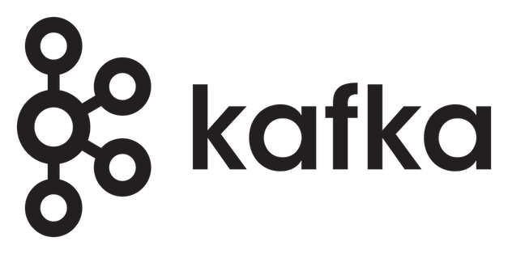

# Kosha Kafka Connector

Apache Kafka is an open source streaming platform made popular by its stream processing capabilities. Its an industry-leading platform for building real-time data pipelines that function at large scale. Its also popular due to its streaming analytics and data integration capabilities. 

The Kosha Kafka connector enables you to perform REST API operations from the Kafka API in your Kosha workflow or custom application. Using the Kosha Kafka connector, you can directly access the Kafka platform to:

* Create consumers
* Create and subscribe to topics
* Delete topics
* Produce messages
* Retrieve metadata about broker configurations 

## Useful Actions

You can use the Kosha Kafka connector to manage Kafka producers, consumers, and topics.

Refer to the Kosha Kafka connector [API specification](openapi.json) for details.

### Producers

Kafka Producers are client applications that publish (write) streaming events to a Kafka cluster. Use the Producer API to produce Kafka messages. 

### Consumers 

Kafka consumers are client applications that subscribe to (read and process) streaming events. Use the Consumer API to create new Kafka Consumers and consume messages from a Kafka topic. 

### Topics

In Kafka, topics store events. Producers write to topics and consumers read or process events from topic. Use the Kafka APIs to subscribe to topics, create topics, delete topics, and get topic metadata. 
  
## Authentication

To authenticate when provisioning the Kosha Kafka connector, you need your:

* Kafka Broker address and port
* Kafka Broker username
* Kafka Broker password
